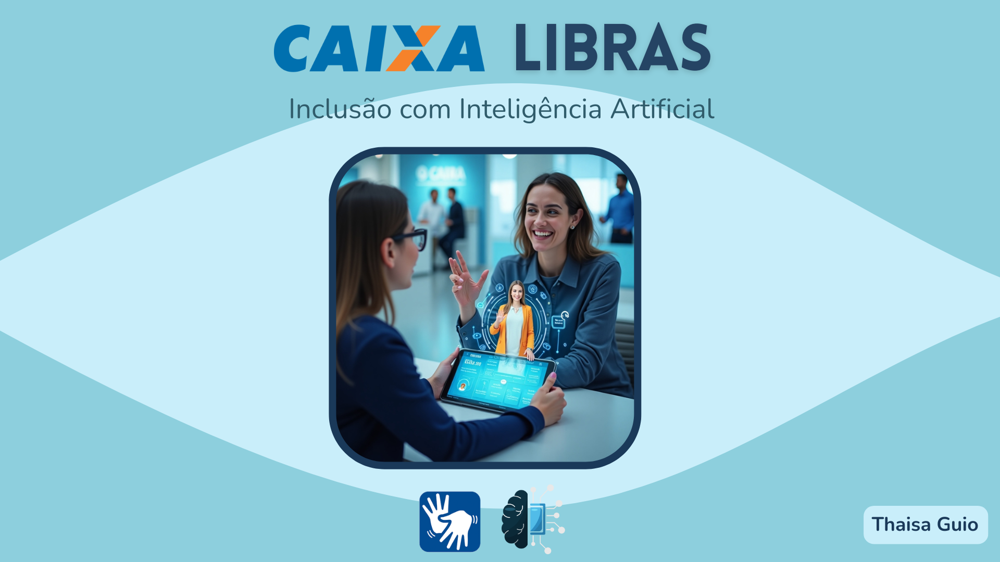

# Projeto IA Generativa
## Desafio CAIXA - Criando Impacto Social com IA 

## CAIXA Libras: Inclusão com Inteligência Artificial

 
 > ℹ️ **NOTA**: Este projeto foi criado para o bootcamp DIO "CAIXA - IA Generativa com Microsoft Copilot".

## 📒 Descrição

Projeto para o Desafio CAIXA - Criando Impacto Social com IA, do bootcamp DIO "CAIXA - IA Generativa com Microsoft Copilot".

📖 Leia o e-book do projeto: [Clique Aqui](https://github.com/thaisaguio/desafio-caixa-libras-inclusao-com-inteligencia-artificial/blob/main/output/e-book-caixa-libras-inclusao-com-inteligencia-artificial.pdf)

🎙️ Ouça o Podcast sobre o projeto: [Clique Aqui](https://github.com/thaisaguio/desafio-caixa-libras-inclusao-com-inteligencia-artificial/blob/main/output/podcast-caixa-libras-inclusao-com-inteligencia-artificial.mp4)
     
Nota:  Limitação no tamanho de envio de arquivo do GitHub forçou menor qualidade do arquivo .mp4 

## 🤖 Tecnologias Utilizadas

- [ChatGPT](https://chatgpt.com/)
- [Leonardo.AI](https://leonardo.ai/)
- [CANVA](https://www.canva.com/)
- [ElevenLabs](https://beta.elevenlabs.io/)
- [Capcut](https://www.capcut.com/pt-br/)

## 🧠 Sobre o projeto  

📖 Todos os detalhes no e-book: [Clique Aqui](https://github.com/thaisaguio/desafio-caixa-libras-inclusao-com-inteligencia-artificial/blob/main/output/e-book-caixa-libras-inclusao-com-inteligencia-artificial.pdf)  

| Seção | Conteúdo |
| --- | --- |
| Introdução | No Brasil, cerca de 10,7 milhões de pessoas possuem algum grau de deficiência auditiva, segundo o IBGE. Apesar da relevância desse grupo, muitas instituições ainda não oferecem serviços adequados para atender às suas necessidades específicas. Em um contexto onde a inclusão social é uma prioridade crescente, a CAIXA Econômica Federal pode liderar essa transformação ao implementar soluções acessíveis e inovadoras. A IA generativa surge como uma ferramenta poderosa para preencher lacunas de comunicação e promover autonomia. Diferentemente de soluções tradicionais, que frequentemente se limitam a legendas ou interfaces textuais, a IA generativa permite a criação de experiências personalizadas, como traduções automáticas para Libras (Língua Brasileira de Sinais). É importante ressaltar que Libras é a primeira língua da maior parte da população surda no Brasil, enquanto o Português é frequentemente aprendido como segunda língua. Por isso, o uso de Libras nas soluções propostas é essencial para garantir que a comunicação seja efetiva e inclusiva, da mesma forma que os intérpretes de Libras são fundamentais nesse processo. Este projeto busca fornecer ferramentas acessíveis que democratizem o acesso da população surda brasileira aos serviços financeiros da CAIXA, promovendo igualdade e impacto social.|
| Contexto e problematização | A população surda enfrenta diversos desafios ao acessar serviços bancários no Brasil: • Falta de Acessibilidade: A maioria das agências bancárias não conta com ferramentas acessíveis em Libras (Língua Brasileira de Sinais). • Dificuldades de Comunicação: Barreiras linguísticas frequentemente resultam em uma experiência de atendimento inadequada e frustrante. • Exclusão Digital: Muitos serviços online não possuem funcionalidades que atendam às necessidades dessa população. A ausência de soluções tecnológicas eficazes impede uma atendimento pleno às necessidades dessa parcela significativa da população brasileira.|
| Objetivos da solução | Objetivo Geral: • Implementar soluções acessíveis baseadas em IA para aprimorar o atendimento da CAIXA à população surda, garantindo igualdade no acesso a serviços financeiros. Objetivos Específicos: • Desenvolver ferramentas digitais que traduzam em tempo real entre Português e Libras. • Oferecer suporte inclusivo em canais presenciais e digitais. • Promover capacitação interna com o uso de tecnologias acessíveis para os funcionários da CAIXA. • Integrar soluções de IA generativa para personalizar experiências de atendimento. |
| Solução proposta com o uso de IA | Assistente Virtual Inclusivo (Tradução Automática em Libras e Reposta Personalizada), Atendimento Presencial Adaptado (Tradução em Tempo Real e Reconhecimento Facial e Gestual), Inclusão em Canais Digitais (Interface Acessível no App da CAIXA e Tutoriais em Libras), Capacitação Interna (Treinamento com IA e Feedback Automatizado).|
| Impactos da solução | Acessibilidade Garantida, Inclusão Social, Fortalecimento da Cidadania, Reconhecimento da CAIXA como Instituição Inclusiva, Capacitação dos Funcionários. |
| Conclusão | Com a implementação deste projeto, a CAIXA Econômica Federal tem a oportunidade de se tornar pioneira em acessibilidade bancária no Brasil. O uso de IA generativa e outras tecnologias emergentes não apenas facilita a inclusão da população surda, mas também reforça seu papel como agente transformador na promoção da igualdade social. Esta iniciativa cria um impacto duradouro, garantindo que todos os brasileiros tenham acesso pleno e justo a serviços financeiros. |

## 🧐 Processo de Criação

- ChatGPT: Conteúdo do e-book, título/subtítulo do projeto, roteiro do podcast (todos foram gerados no mesmo chat).
- Leonardo.AI: Imagens para o e-book.
- CANVA: Diagramação e confecção do e-book e da imagem de capa do podcast.
- ElevenLabs: Conversão text-to-speech do roteiro do podcast para o áudio do podcast (Voz: Matilda | Modelo: Eleven Turbo 2.5 | Stability: 45% |  Similarity: 65%).
- Capcut: Tratamento do áudio do podcast, efeitos e trilha.  
  
-------------------------------------------------------

- ChatGPT:
  
| Ação | Prompts |
| --- | --- |
| Conteúdo do e-book | PROMPT 1: "Preciso elaborar um projeto para o banco CAIXA Econômica Federal que, utilizando IA generativa, possa fornecer impactos sociais no Brasil. Forneça 3 sugestões interessantes de projeto. Cada uma deve conter: 1. introdução, 2. contexto e problematização, 3. objetivos do projeto, 4. solução proposta com o uso da IA generativa, 5. os impactos sociais concretos e 6. conclusão." OUTPUT 1: "Conteúdo básico para 3 projetos (Projeto 1: Inclusão Digital e Financeira com Assistentes Virtuais em Comunidades Vulneráveis, Projeto 2: IA Generativa para Fomento ao Microempreendedorismo Local, Projeto 3: IA Generativa para Habitação e Planejamento Urbano Sustentável)." Gostei muito do projeto 3, porém achei muito amplo. Pensando em aprimorar o atendimento da CAIXA para a população surda, elaborei mais um prompt.|
| Conteúdo do e-book | PROMPT 2: "Use o mesmo tipo de modelo de projeto acima, como o do uso da IA para habitação e planejamento. Porém, agora aplique a um outro contexto brasileiro em que a CAIXA Econômica Federal também pode fazer uso de IA generativa para criar impacto social: o atendimento à população surda." |
| Conteúdo do e-book | Como o projeto ficou muito enxuto, solicitei em um novo prompt que o ChatGPT expandisse as ideias. PROMPT 3: "Gostei muito da ideia de projeto 3. Poderia elaborar um pouco mais o projeto, por favor?" Demais prompts foram solicitados para aprimorar o conteúdo do e-book ainda mais, além de algumas correções humanas pontuais.|
| Título/subtítulo do projeto | "Me forneça um nome criativo para o projeto que inclua o nome do banco "CAIXA" no título.". Output: "CAIXA Acessível: Inclusão com Inteligência Artificial|
| Prompt para ser usado no Leonard.AI | "Forneça um prompt, em inglês, que eu poderia usar para gerar uma imagem da capa desse projeto em uma ferramenta de IA generativa de imagem como o Leonard.ai.". Output: "An inclusive and innovative design showcasing modern AI technology supporting deaf individuals in a professional banking environment. The image features a virtual assistant represented as a holographic avatar translating sign language (Libras) on a tablet or smartphone screen. In the background, a friendly, accessible bank setting with diverse people interacting. The scene includes vibrant yet professional colors like blue and white, emphasizing trust and modernity. The title 'Inclusive Banking with AI' is integrated subtly in the top right corner in a clean, sans-serif font."|
| Roteiro do podcast | PROMPT: "Você é um roteirista de podcast. Vamos criar um podcast para apresentar a solução “Projeto: IA Generativa para Inclusão no Atendimento à População Surda”, criada acima. O formato do roteiro deve corresponder às seções do projeto, ou seja: [Introdução] [Contexto e Problematização] [Objetivos da Solução] [Solução Proposta com o Uso de IA] [Conclusão] {REGRAS} - O podcast será apresentado pela apresentadora de nome: Thaisa Guio, funcionária CAIXA da área de TI. Ela é analista e cientista de dados, com experiência no mundo do Python e da Inteligência Artificial. - A apresentação deve ser amigável, explicando a solução com termos claros e simples, porém precisos, passando pelas seções do projeto, conforme explicado acima. – O último trecho da conclusão do podcast deve usar o slogan da CAIXA Econômica Federal, a saber: “Vem pra CAIXA você também! Vem!” {REGRAS NEGATIVAS} - Não ultrapasse 3 minutos de duração." A saída foi aprimorada e usada no ElevenLabs para a conversão text-to-speech.|

- Leonardo.AI:
  
| Ação | Prompts |
| --- | --- |
| Criar imagens para o e-book | O output gerado pelo ChatGPT acima foi alterado para "An inclusive and innovative design showcasing modern AI technology supporting deaf individuals in a professional banking environment. The image features a virtual assistant represented as a holographic avatar translating brazilian sign language (Libras) on a tablet or smartphone screen and a deaf smiling woman using sing language with simple clothes. In the background, a friendly, accessible bank setting with diverse people interacting. The scene includes vibrant yet professional colors like blue, white and orange, emphasizing trust and modernity. The format should be A4 size, for the cover art of an e-book." As imagens usadas na capa do e-book e dentro do e-book foram outputs deste prompt e prompts melhorados, por exemplo, pedindo de forma extra "a smiling black-skinned woman using sign language, wearing simple and casual clothes."|

## 🚀 Resultados

📖 Leia o e-book do projeto: [Clique Aqui](https://github.com/thaisaguio/desafio-caixa-libras-inclusao-com-inteligencia-artificial/blob/main/output/e-book-caixa-libras-inclusao-com-inteligencia-artificial.pdf)

🎙️ Ouça o Podcast sobre o projeto: [Clique Aqui](https://github.com/thaisaguio/desafio-caixa-libras-inclusao-com-inteligencia-artificial/blob/main/output/podcast-caixa-libras-inclusao-com-inteligencia-artificial.mp4)

## 👨‍💻 Autoria

    
    
&nbsp&nbsp&nbspThaisa Guio 
    &nbsp&nbsp&nbsp
    <a 
        href="https://github.com/thaisaguio">
        GitHub
    </a>
    &nbsp;|&nbsp;
    <a 
        href="https://www.linkedin.com/thaisa-guio/">
        LinkedIn
    </a>
    &nbsp;|&nbsp;
    <a 
        href="https://www.instagram.com/thaisaguio">
        Instagram
    </a>
    &nbsp;|&nbsp;

  

---

⌨️ com 💜 por [Thaisa Guio](https://github.com/thaisaguio)
